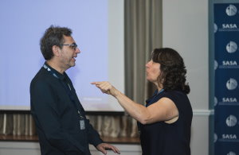
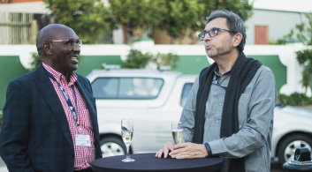
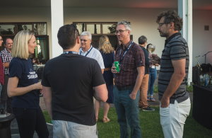

I have participated to the 63rd edition of the annual conference of the South African Statistical Association (SASA), of which I am a member.  

The conference was held in George (Western Cape Province) with good participation and high level of presentations.

I have contributed with an oral presentation, which you can find here: [annibalecois.github.io/metaregression](https://annibalecois.github.io/metaregression/#1)  

We also had some fun: 

|||||
|:-:|:-:|:-:|:-:|
  

You can look at other pictures in the [SASA website:](https://www.sastat.org/events/conferences/sasa2022/photos). 
 

