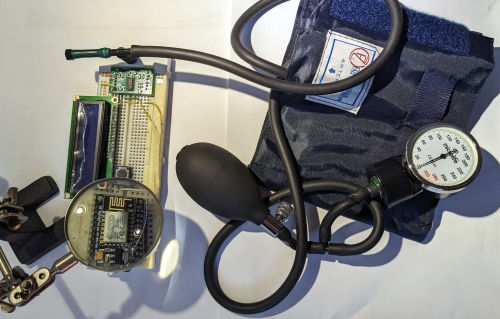
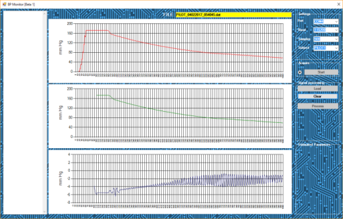

Anthropometric measurements (such as measures of body shape, systolic and diastolic blood pressure, heart rate and may other) have been repeatedly shown to be correlated with risk of future development of a host of non communicable disease, such as cardiovascular disease, diabetes and some types of cancer.  
 
Leveraging the growing availability of low-cost microcontrollers and quality sensor, this project aims at experimenting innovative low-cost hardware/software solutions to collect reliable anthropometric measurements for use in epidemiological investigation and risk stratification in population surveys. 
  
Preliminary investigation has addressed:

* **Augmented blood pressure measurements** for CVD risk prediction

ESP-32 based data logger for no-invasive connection to commercial oscillometric Blood Pressure monitors and recording of : (1) the detailed shape of the deflation curve during automatic blood pressure measurement and subsequent estimation of the central BP and indicators of arterial stiffness; (2) environental parameters (room temperature, atmospheric pressure, noise level and arm position) for measurement correction.  

A pre-engineering functional prototype and its output are shown below:

|||
|:-:|:-:|

* **Use of photographs fr body composition estimation** 

Potential of developing ML algorithms for the estimation of body composition (% and distribution of fat mass) from 2-D photographs, for adults and children.  

