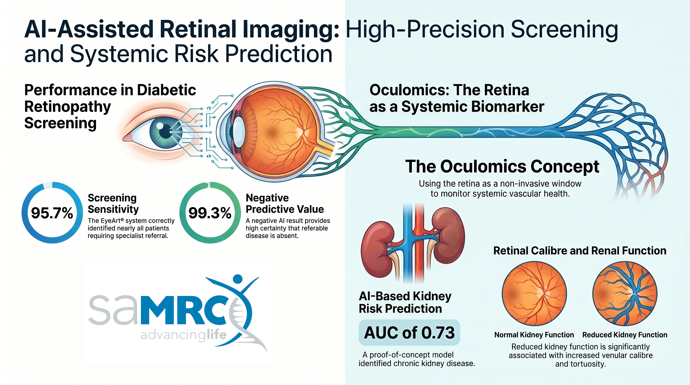

 
<h2>Watch a short <a href="https://youtu.be/5ryF8YqDxAU">video overview</a> of the project and its first results</h2>

 

Diabetic retinopathy (DR) is one of the leading causes of preventable vision loss globally and represents a major microvascular complication of diabetes mellitus. Early detection through systematic retinal screening is essential to prevent progression to vision-threatening disease. However, conventional ophthalmologic screening pathways are resource-intensive and difficult to scale, particularly in settings where access to specialist eye care is limited. Recent advances in artificial intelligence (AI)-assisted retinal image analysis offer the potential to improve accessibility, standardisation, and cost-effectiveness of DR screening programs.
This pilot project evaluated the first 24 months of implementation of an AI-assisted diabetic retinopathy screening programme conducted through the Retinography Project in Somerset West, South Africa. The programme integrated non-mydriatic fundus photography into routine diabetic care at an endocrinology practice, with retinal images analysed in real time by the EyeArt® AI Eye Screening System. Patients identified as having potentially referable disease were referred for specialist ophthalmologic evaluation. The study also explored the performance of an alternative AI platform, SugarwaveAI®, and conducted a preliminary cost analysis comparing AI-based screening with traditional referral pathways.
In addition, the study investigated the potential use of AI-based analyses of retinal fundus images for vascular risk stratification. Retinal fundus images were analysed using automated deep learning pipelines to extract quantitative vascular features, including vessel calibre, tortuosity, vessel density, and fractal dimension. These retinal parameters were then examined in relation to systemic biomarkers and clinically documented diabetic complications, including chronic kidney disease, cardiovascular disease, and peripheral neuropathy. A proof-of-concept deep learning model for the identification of chronic kidney disease directly from retinal fundus images was also developed.  
  
**Participants**  
A total of 320 diabetic patients underwent screening during the study period, of whom 200 consented to participate in the evaluation. Participants were predominantly middle-aged adults with a high burden of comorbidities including hypertension, obesity, peripheral neuropathy, and kidney disease. Most participants had type 2 diabetes, and glycaemic control was suboptimal in a substantial proportion of the cohort.  
    
    
    
**Results 1: Performance of the AI-based system for retinopathy screening**   
The prevalence of referable diabetic retinopathy according to expert ophthalmologic grading was 11.8%, while the prevalence of any diabetic retinopathy was 43.6%. Vision-threatening diabetic retinopathy was identified in 8.7% of participants. Diabetic macular oedema was present in 7% of patients according to expert assessment. Overall image gradability was excellent, with only a small number of retinal photographs deemed ungradable by either the AI system or the ophthalmologist.
The EyeArt® AI system demonstrated excellent screening sensitivity for referable diabetic retinopathy (95.7%) and a high negative predictive value (99.3%), indicating strong performance in ruling out disease. Specificity was lower (84.9%), resulting in some over-referral of patients without referable disease, but this is generally acceptable in a screening context where minimising missed cases is prioritised. Agreement between the AI system and expert ophthalmologic grading ranged from moderate to substantial across different diagnostic categories. The system performed particularly well in identifying vision-threatening disease.
In comparison, the SugarwaveAI® system demonstrated similarly high sensitivity but substantially lower specificity (46.5%), leading to markedly higher false-positive referral rates. Overdiagnosis was particularly evident among younger patients without diabetic retinopathy. While the system maintained a high negative predictive value, the lower specificity substantially reduced its operational efficiency and increased projected downstream healthcare costs.
The pilot cost analysis suggested that the AI-assisted screening model was consistently more cost-effective than traditional referral-based screening pathways. The AI-based programme identified more cases of diabetic retinopathy while simultaneously reducing the cost per case detected. The benefits were especially pronounced in lower-prevalence settings, where indiscriminate referral of all diabetic patients for specialist screening is economically inefficient. The analysis also demonstrated that screening performance characteristics, particularly specificity, substantially influence downstream healthcare costs.
Overall, the findings support the feasibility and effectiveness of integrating AI-assisted retinal screening into routine diabetes care at the primary or secondary healthcare level. The EyeArt® system demonstrated strong clinical utility as a high-sensitivity triage tool capable of improving access to diabetic retinopathy screening while reducing reliance on specialist ophthalmologic services. The results further highlight the importance of careful validation of AI systems before implementation, as differences in specificity can significantly affect healthcare utilisation and programme costs.
The Retinography Project provides a promising model for scalable diabetic retinopathy screening in South Africa and similar resource-constrained settings. Further research involving larger and more diverse populations, longitudinal follow-up, and real-world implementation outcomes will be valuable to confirm the long-term effectiveness, sustainability, and economic benefits of AI-assisted retinal screening programmes.  
  
**Results 2: AI for vascular risk stratification**
The results of the analyses provide preliminary evidence that retinal vascular morphology is associated with several important systemic indicators of diabetic disease severity and vascular dysfunction. Reduced kidney function, reflected by lower estimated glomerular filtration rate (eGFR) and higher serum creatinine levels, was associated with increased venular calibre and tortuosity. Poor glycaemic control, measured through HbA1c, was associated with reduced fractal dimension and vessel density, suggesting loss of vascular complexity and microvascular rarefaction. Measures of venular tortuosity were also associated with adverse lipid profiles.
Although the performance of the deep learning model for the identification of chronic kidney disease were modest (mean AUC = 0.73), the results demonstrate the feasibility of using retinal imaging as a low-cost, non-invasive adjunct tool for systemic vascular risk stratification in diabetic populations. Attention analyses using Grad-CAM suggested that the model relied on biologically plausible retinal regions and vascular structures during prediction.
The study was exploratory in nature and should primarily be interpreted as a proof-of-concept investigation conducted in a real-world clinical environment. The sample size was relatively small, and the analyses involved multiple comparisons without formal correction procedures. Consequently, the reported associations should not be interpreted as definitive evidence of causality or clinical utility. Instead, they provide important signals and hypotheses for future validation studies.
Despite these limitations, the findings align with the growing field of oculomics, which conceptualises the retina as a readily accessible biomarker of systemic vascular health. The results support the feasibility of integrating AI-assisted retinal imaging into broader diabetic care pathways, particularly in resource-constrained settings where traditional laboratory-based risk stratification may be difficult to implement at scale.  
  
More information: 

* [Study overview and summary results](Retinography_Summary.pdf)
* [AI-generated video oveview](https://youtu.be/5ryF8YqDxAU) 
* [The retinography project](https://retinography.co.za/)
  
* [Technical Report 1: Performance of the AI-based system for retinopathy screening](Retinal_Imaging_1.pdf)
* [Technical Report 2: Vascular risk stratification](Retinal_Imaging_2.pdf)
