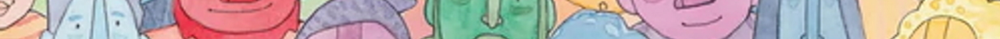
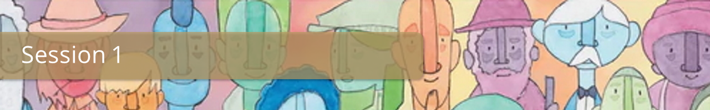
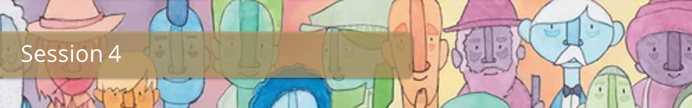

# Course Material

   



</img> 
  
  
This course at Stellenbosch University  presents the theoretical basis and the practical implications of using surveys as a research tool in the health sciences. It aims to enable participants (1) to understand the logic and process of conducting surveys and to appreciate their strengths and limitations; (3) to design and evaluate alternative sampling strategies; (4) to plan and undertake their own surveys.

The course is offered in an online format, with weekly contact sessions, individual engagement with the teaching material (including podcasts, recorded lectures, readings), discussion forums with presenters and peers, and interaction with the SurveyLab (surveylab.sun.ac.za) virtual environment. The latter consists of a simulated human population of 40000 individuals which can be surveyed and analysed and allows participants to experiment with the concepts and techniques taught in the course, by designing virtual surveys, sampling the population according to their plan, and conducting virtual data collections. 

Teaching Staff:

**Dr Annibale Cois, MEng, MPH, PhD**  
*Department of Global Health, Stellenbosch University*  
*Division of Epidemiology and Biostatistics, University of Cape Town*  
***Course Convenor*** 
 
**Dr Alberto Caoci**  
University of Cape Town  
**Dr Rifqah Roomaney**  
South Africa Medical Research Council  
**Ms Stacey Blows**  
Stellenbosch University  
**Mr Jerall Toi**  
Stellenbosch University  
 

### Overview
*Lecture slides*  
<i class="fas fa-link"></i> [1.0 - Overwiew](Overview.pdf)

### Resources

<i class="fas fa-file-pdf"></i> [Course Outline](Outline.pdf)
<i class="fas fa-file-pdf"></i> [Course Schedule](Schedule.pdf)

<i class="fas fa-link"></i> [SurveyLab](https://surveylab.sun.ac.za/) 
<i class="fas fa-link"></i> [SurveyLab Manual & VidoTutorials](project/surveylab/) 
<i class="fas fa-link"></i> [SurveyLab2 (Development version)](https://surveylab2.pages.dev/)

<i class="fas fa-file-pdf"></i> [Microsoft Teams Cheat  Sheet](https://online.sun.ac.za/pluginfile.php/219989/mod_page/content/1/Teams%20Quick%20Start.pdf)
<i class="fas fa-video"></i> [Video training on using Microsoft Teams](https://support.microsoft.com/en-us/office/microsoft-teams-video-training-4f108e54-240b-4351-8084-b1089f0d21d7?ui=en-us&rs=en-us&ad=us)   
  
</img>    
  





</img>  

### Lectures
*Lecture slides*  

<i class="fas fa-file-pdf"></i> [1.1 - The scope of survey research](I/Slides11.pdf)
<i class="fas fa-file-pdf"></i> [1.2 - Surveys in health research](I/Slides12.pdf)
<i class="fas fa-file-pdf"></i> [1.3 - Formalising the survey process](I/Slides13.pdf)

### Preliminary activities
*Prescribed readings and activities to complete **before** the session*

 - NO ACTIVITIES 

### Resources
*Prescribed readings and additional materials*

#### Prescribed
<i class="fas fa-file-pdf"></i> [Fandino2019](I/Fandino2019.pdf)
<i class="fas fa-file-pdf"></i> [Groves2011](I/Groves2011.pdf)
<i class="fas fa-file-pdf"></i> [Park2020](I/Park20201.pdf)
<i class="fas fa-file-pdf"></i> [Shimizu2020](I/Shimizu2020.pdf)

#### Exercises
<i class="fas fa-file-pdf"></i> [Hird2016](I/Hird2016.pdf)
<i class="fas fa-file-pdf"></i> [Hodkinson2020](I/Hodkinson2020.pdf)
<i class="fas fa-file-pdf"></i> [Nunu2017](I/Nunu2017.pdf)
<i class="fas fa-file-pdf"></i> [Owolabi2022](I/Owolabi2022.pdf)
<i class="fas fa-file-pdf"></i> [REDCap Codebook](I/REDCap.pdf)

#### Additional
<i class="fas fa-file-pdf"></i> [Brown2019](I/Fandino2019.pdf)
<i class="fas fa-file-pdf"></i> [Lund2018](I/Groves2011.pdf)
<i class="fas fa-file-pdf"></i> [Nundy2022 - Chapter 7](I/Nundy2022.pdf)  
  
<i class="fas fa-video"></i> [The DHS Program](https://www.youtube.com/embed/abP6xeb50Do)
<i class="fas fa-video"></i> [COVID 19 Antibody Study](https://www.youtube.com/embed/t8P_cbRAx24)
<i class="fas fa-video"></i> [CHR Survey](https://www.youtube.com/embed/CknX4rxb6QA)
<i class="fas fa-video"></i> [CHIS Overview](https://www.youtube.com/embed/QPpSVyZxslo)
  
</img>  
  





</img>  

### Lectures
*Lecture slides*  

<i class="fas fa-file-pdf"></i> [2.1 - Survey Error](II/Slides11.pdf)
<i class="fas fa-file-pdf"></i> [2.2 - Target population, study population and sampling](II/Slides12.pdf)
<i class="fas fa-file-pdf"></i> [2.3 - Sampling strategies](II/Slides13.pdf)

### Preliminary activities
*Prescribed readings and activities to complete **before** the session*

 - Reading: [Leibbrand2009: Pages 9-12](http://www.nids.uct.ac.za/publications/technical-papers/108-nids-technical-paper-no1/file)
 - Reading: [Scholz2021](https://sajip.co.za/index.php/sajip/article/view/1837)
 - Complete the SurveyLab Exercise and get prepared to report in class.

### Resources
*Prescribed readings and additional materials*

#### Prescribed
<i class="fas fa-file-pdf"></i> [Groves2010](II/Groves2010.pdf)
<i class="fas fa-file-pdf"></i> [Biemer2010](II/Biemer2010.pdf)
<i class="fas fa-file-pdf"></i> [Magnani2005](II/Magnani2005.pdf)
<i class="fas fa-file-pdf"></i> [Scholtz2021](II/Scholtz2021.pdf)

#### Exercises
<i class="fas fa-file-pdf"></i> [Leibbrand2009](II/Leibbrand2009.pdf)
<i class="fas fa-file-pdf"></i> [Sampling Frame](II/Frame30.xlsx)

#### Additional
<i class="fas fa-file-pdf"></i> [Sikorskii2009](II/Sikorskii2009.pdf)
<i class="fas fa-file-pdf"></i> [Callegaro2010](II/Callegaro2010.pdf)
<i class="fas fa-file-pdf"></i> [Cois2017](II/Cois2017.pdf)  
<i class="fas fa-file-pdf"></i> [Cornesse2018a](II/Cornesse2018a.pdf)
<i class="fas fa-file-pdf"></i> [Couper2017](II/Couper2017.pdf)
<i class="fas fa-file-pdf"></i> [Deloitte2020](II/Deloitte2020.pdf)  
<i class="fas fa-file-pdf"></i> [Couper2017](II/Peterson2017.pdf)
<i class="fas fa-file-pdf"></i> [Deloitte2020](II/Deloitte2020.pdf)  

</img>  
  





</img>  
  
</img>   
    





</img>  
  
</img>  
  





</img>  
  
</img>  
  

  


   


</img>  
  
</img>   
   



  

