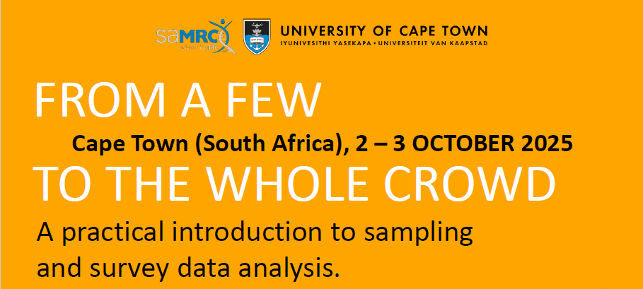

  

  

# Resources   

     

* **Software**
  
  * R:  
    
    * [Windows](https://cran.r-project.org/bin/windows/base/) 
    * [Mac](https://cran.r-project.org/bin/macosx/) 
    * [Linux](https://cran.r-project.org/bin/linux/)  
    
    
   
  * R Studio (suggested):     
   
    * [R Studio](https://posit.co/downloads/)
     
       
     
  * R packages:  
    
    * [Survey](https://cran.r-project.org/web/packages/survey/index.html) 
    * [gee](https://cran.r-project.org/web/packages/gee/)  
    * [geepack](https://cran.r-project.org/web/packages/geepack/index.html)  
    * [lme4](https://cran.r-project.org/web/packages/lme4/index.html)   
     
     
   
* **Slides:**

  * Day 1: [Download](Slides_day1.pdf)
  * Day 2: [Download](Slides_day2.pdf)  

    

* **Example analysis code:**

  * R Code: [Download (pdf)](ExampleCode.pdf)

    
  
* **SurveyLab:**

  * SurveyLab [Connect](http://shiny.samrc.ac.za:3838/SurveyLab/)

    

* **Workshop evaluation form:**

  * [Form](https://019929b6-0f05-00e0-520b-0677223602f7.share.connect.posit.cloud/)

    

